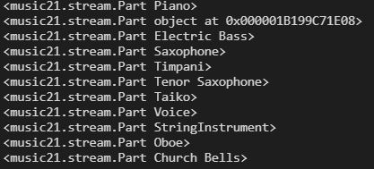

# `music21` and Data Processing

#### Author: Jared Frazier

#### Date: 04/05/2021

Each MIDI can be parsed using the `music21` library from MIT. To install this library using anaconda, type `conda install -c iainsgillis music21` into the Anaconda Prompt. You will also need to have `matplotlib` and `scipy` and `numpy` for `music21` to work properly.

Using `music21`, MIDIs can be decomposed into ` <class 'music21.stream.Score'>` object that is composed of `<class 'music21.stream.part PART_NAME'>`objects. The PART_NAME describes the instrument that is relevant to that MIDI channel. For example, below is an image of the parts for the `akumajo1%28V1.1%29.mid` from the first Castlevania game.

Each `<class 'music21.stream.part PART_NAME'>` object in turn is an iterable where each element is _either_ an object of `<class 'music21.note.Note'>` or `<class 'music21.chord.Chord'>`type. These elements are converted to strings since their current type cannot be used for neural nets.

#### Considerations

These strings must be encoded so that they may be fed into neural nets.
